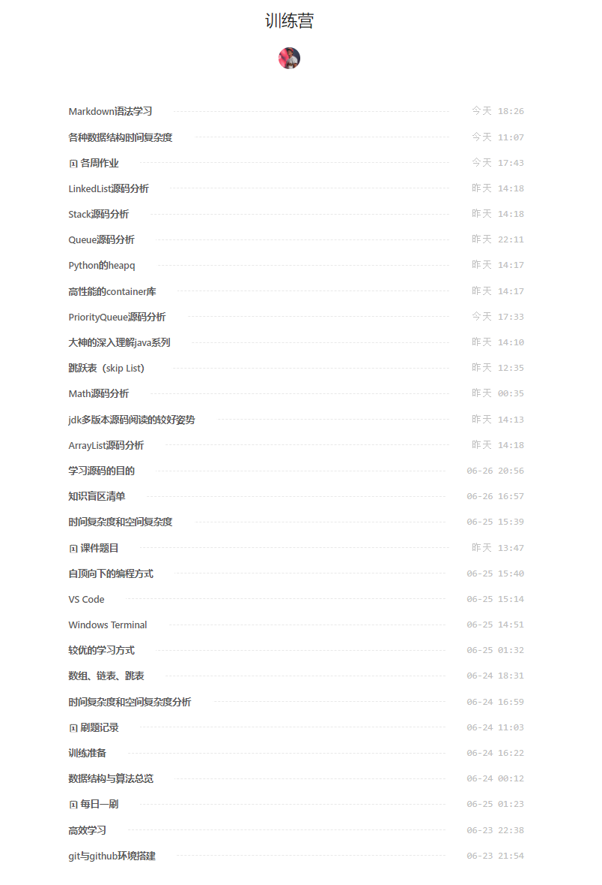

## 第一周学习笔记
### 第一次之难，难于上青天

+ 入手训练营，刚开始很是懵逼，以为手机可以观看，一直没看到课程上线，然后就真的以为没上线了。
正好20号出差，晚上在酒店用笔记本登录了一下，瞬间感到泪崩。于是开始疯狂学习视频，毕竟基础比较薄弱。


+ 一开始只是看视频。到后来发现看过不动手，早晚还给老师。所以就一边做笔记，一边跟着搭建环境。笔记是通过语雀来记录的，一周过去了发现记录了不少，当然大部分是流水账哈哈哈。


 
 + 刚开始学习的时候，真的是什么方法都没有，就是胡乱地尝试，也体现出自己的习惯，只有一遍过数，而没有多过遍数。在微信读书，看过一部分《异类：不一样的成功启示录》，感觉就是好的方法+过遍数（10000小时法则）是专家的必经之路。而有木有成功的机遇就是另外再论了，毕竟，只要有基础在身，机遇来了马上就可以上手了。还有一个很现实的是门槛效应，智商达不到，就没能跨过人才划分的门槛，而智商越高并不代表获得诺贝尔奖的概率就越高！而会算法和数据结构，正如同大厂的门槛，当然，算法和数据结构越厉害不代表进大厂的概率就越高，但不会，凉凉！
 ---

### 第一次遇到的坑

#### 阅读源码，乱糟糟
+ 之前都是通过文字理论来理解技术的，当真正落实到通过jdk源码来理解技术的时候，就发现连怎么上手都很模糊。好在超哥有提供指引，自己按照搜索只用Google，java API文档和多版本jdk源码对照阅读，同时不懂的多拜读前辈写的博客，综合理解。

+ 最终输出自己的源码学习方式，按照形成知识关联网+过遍数的方式，就是根据思维导图+人类遗忘曲线类比而来。

+ 因为源码，从表面来看，就是语言语法+数据结构与算法+设计模式综合而来的，因为是在计算机上面执行的，因此计算机科学基础知识就必不可少。而源码的用途就是在更高一层的角度进行分析了。

+ 之所以通过这样的学习方式，因为分析不同的源码，所用的知识点必定是其他源码有涉及到的，通过在不同时间段进行过遍数，能帮助人类加深对该知识点的记忆，而有关系的知识网络，也是人类记忆最擅长的。

+ [《Queue源码分析》](https://www.yuque.com/docs/share/8cd2533e-0f5b-4731-82e9-6c4fcbbd92a0?#)
+ [《PriorityQueue源码分析》](https://www.yuque.com/docs/share/393235da-98f8-4abd-97e4-5ddb4b78d50c?# )
---


#### 刷题时，不知所措

+ 一开始想着刷题是很简单的事，因为按照五毒神掌来操练，不是很快吗？好像是这样的，这样可以很快速地把题型及解法记忆住。但是，后来自己的心态让自己搞崩了。怎么崩的？案发现场：一开始，跟着看视频，卧槽，这个我还不会，那个我也还不会，我得先学习积累一下，然后就没了规划这个能力，陷入死磕学习理论知识，直到现在我也不能保证以后不会有死磕学习理论知识的习惯。

+ 死磕学习理论知识，效率低，而且不按照人类遗忘曲线的规律走，有时候也没形成知识网络，浪费时间啊。

+ 然后到周六，快要周天的时候，你知道的，人就开始急了。想临时抱佛脚了。然后就开始真正动手做题了。一做才发现，这题目用到的知识点都是老师目前讲到的，大部分也都是简单题，但是就是因为死磕理论知识，浪费时间也没效率，导致时间不够了。辛亏自己还不会死磕题目，要不然就真的只收获崩溃的心态。

+ 现在已经是周日的22:37了，到目前为止，自己做最多的就是写语雀文章，因为已经写习惯了，对于做题，只做了2道。2道题目的解法都没想到，看了题解才想到，但得到一点经验：1、对题目大意进行拆解分析；2、对解法进行图解演示，需要真正动笔画并推导验证可行时，才撸代码！

+ 26、删除排序数组中的重复项。这道题是我leetcode的第一道题，以前从没做过，看看就知道是小白，纯粹就是优质的实验品。关键还答错了，然后直接看题解，使用快慢指针解答了，但现在也有点模糊，真的表明五毒神掌的必要性了。

```
//1、暴力求解：对每个数进行遍历，发现有就删除，数组长度也跟着实时变小。
class Solution {
    public int removeDuplicates(int[] nums) {
        if(nums==null){
            return 0;
        }
        int length = nums.length;
        for(int i=0;i<length;i++){
            for(int j=i+1;j<length;j++){
                if(nums[i]==nums[j]){
                    for(int k=j;k<length-1;k++){
                        nums[k]=nums[k+1];
                    }
                    nums[length-1]=0;
                    length--;
                }
            }
        }
        return length;
    }
}
```

+ 189、旋转数组。这道题目自己以为想出方法了，然后没动手画一下，推导验证一下，结果发现想的太简单了。自己只是想到方法3使用环状替换的一半思路。当然，答案也是错的。然后直接看题解，发现自己在认真读题后，理解题目大意了，但在获得解法后，缺乏推导验证解法的过程，就直接撸代码，结果是一团糟，因为方向一开始就错了，然后我还一路狂奔，如果没有升维概念，空间换时间的概念，自己又怎能快速且愉快地重来一遍，快速得到反馈和最优解呢？
```
class Solution {
    public void rotate(int[] nums, int k) {
        if(k < 0 || nums == null || nums.length == 0){
            return;
        }
        int length = nums.length;
        int leftMove = length-k;
        int count = 0;
        int action = 0;
        int middlePorter = nums[action];
        while(count<length-1){
            //替换
            nums[action] =  nums[(action+leftMove) % length];
            //向左走
            action = (action + leftMove) % length;
           //计数
            count++;
        }
        nums[action] = middlePorter;
    }
}
```
### 总结
+ 1、做任何事，不要死磕！
+ 2、形成知识网络，过遍数（思维导图+人类遗忘曲线）
+ 3、时间分配均匀，当前时间段下，优先级最高的事优先做。（即使能力不够，也要做！！！）例如，该刷题，该看题解，该记录以便辅助刷题，就动手做，不用徘徊等待什么！
+ 4、阅读源码等学习理论知识的方法：形成知识网络+知识点不断重复（博文输出）。
+ 5、刷题方法：拆解题目+解法推导验证+编码+题解总结+五毒神掌（源码+博文输出）。
+ 6、最关键一点：每天重复以上5点。
